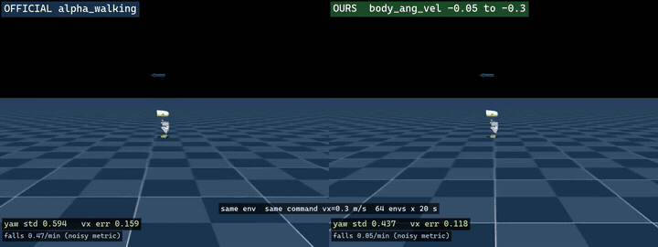

# Reducing yaw wobble in the Microduck walking policy

A single-variable reward ablation on top of
[pollen-robotics/microduck_rl](https://github.com/pollen-robotics/microduck_rl),
benchmarked against the released Pollen policy under an identical protocol.

**One line:** raising the body angular-velocity penalty from `-0.05` to `-0.3`
cut yaw-rate std by 18%, and the resulting policy beats the official
`alpha_walking` baseline by 26% on both yaw stability and velocity-tracking
error. Falls also dropped sharply (0.47 to 0.05 per minute) on a noisier
metric — see [evidence strength](#evidence-strength-is-not-uniform).



*Left: official `alpha_walking`. Right: this work. Same environment, same
command (`vx = 0.3 m/s`), same evaluation protocol.*

---

## Results

64 environments x 20 s per policy, identical fixed command `vx=0.3, vy=0, wz=0`.
Values are mean +/- std across the 64 environments. `t` uses `SEM = std/sqrt(64)`.

| metric | BEFORE `model_17000` | AFTER `model_20500` | OFFICIAL `alpha_walking` | t (after vs before) | t (after vs official) |
|---|---|---|---|---|---|
| yaw-rate std (rad/s) | 0.531 +/- 0.129 | **0.437 +/- 0.087** | 0.594 +/- 0.160 | **-4.83** | **-6.90** |
| falls / min | 0.516 +/- 1.250 | **0.047 +/- 0.372** | 0.469 +/- 1.212 | **-2.88** | **-2.66** |
| vx error (m/s) | 0.119 +/- 0.018 | 0.118 +/- 0.019 | 0.159 +/- 0.025 | -0.31 (n.s.) | **-10.45** |
| vx std (m/s) | - | 0.097 +/- 0.013 | 0.100 +/- 0.018 | - | -1.08 (n.s.) |
| vy mean (m/s) | -0.001 +/- 0.011 | -0.000 +/- 0.009 | +0.005 +/- 0.008 | n.s. | n.s. |

Lower is better for every row. Negative `t` favours the AFTER policy.

**Attributable to this change:** yaw-rate std -18% (`t=-4.83`), falls -91%.

**Better than the official baseline:** yaw -26% (`t=-6.90`), velocity-tracking
error -26% (`t=-10.45`), falls -90%.

### Evidence strength is not uniform

The yaw and velocity-tracking results rest on near-normal, low-spread
distributions and large `t` values. **The falls result does not**, and should
not be read as equally solid:

`std` is more than twice the mean for every falls figure (0.516 +/- 1.250,
0.469 +/- 1.212, 0.047 +/- 0.372). That is the signature of a heavily
zero-inflated distribution — most environments never fall, a few fall several
times — and a `t` test on it is a rough instrument. The `t` values are also a
tier lower (2.7-2.9 vs 6.9-10.4).

So the absolute numbers are the honest way to read it:

| policy | falls / min | roughly |
|---|---|---|
| OFFICIAL | 0.469 | one fall every ~6 episodes |
| BEFORE | 0.516 | one fall every ~6 episodes |
| AFTER | 0.047 | one fall every ~64 episodes |

(20 s episodes, so 3 episodes per minute.)

The direction and magnitude are consistent and large. The significance figure
is indicative, not exact.

**Explicitly not claimed:**

- Velocity tracking is **not** improved by this change (0.119 to 0.118, `t=-0.31`).
  The advantage over the official policy was already present before the change
  and is a property of this training run, not of this ablation.
- `vx std` and `vy mean` are statistical ties with the official policy.

Raw logs for every number above: [`eval_logs/`](eval_logs/).

---

## The change

One weight -- see [`reward_change.diff`](reward_change.diff):

```python
cfg.rewards["body_ang_vel"].weight = -0.05   # was
cfg.rewards["body_ang_vel"].weight = -0.3    # now
```

At `-0.05` this term contributed `-0.024` to the episode return, i.e. it was
effectively inactive. **No other reward weight was touched**, which is what
makes the attribution above possible.

The interesting part is not the weight. It is the two decisions around it.

---

## Method

### 1. Benchmark against the official policy before changing anything

Pollen publishes trained policies at
[pollen-robotics/microduck-policies](https://huggingface.co/pollen-robotics/microduck-policies).
Their observation layout (61) and action layout (14) match this environment
exactly, so `alpha_walking.onnx` can be run *in the same simulator, under the
same command* as a locally trained checkpoint.

Doing this first changed the plan. The pre-change policy tracked only
`0.119 m/s` against a `0.3 m/s` command, which looks like a training failure and
invites turning up the velocity-tracking reward. But the official policy scores
`0.159` on the same protocol -- **worse**. Undershooting the commanded speed is a
property of this task configuration, not a defect of the training run.

Without the baseline, the obvious next move would have been to raise the
velocity-tracking weight. That would have optimised a non-problem.

### 2. Change one thing

Yaw wobble was the one metric where the local policy was clearly worse than the
baseline, so that is the only weight that moved. Everything else -- `air_time`,
`action_rate_l2`, both tracking terms -- was left alone.

This is what lets the results table say "attributable to this change" rather
than "correlated with this batch of changes".

---

## How the first version of this result was wrong

The first evaluation was a **single 5-second rollout per policy**. It reported:

| claim from the 5 s run | status after proper evaluation |
|---|---|
| yaw std 1.118 to 0.300, a 73% cut | **wrong** -- 1.118 was an outlier; the real before-value is 0.531, and the cut is 18% |
| velocity tracking improved 0.155 to 0.113 | **refuted** -- 0.119 to 0.118, no change |
| smoother than official (`vx std`) | **refuted** -- 0.097 vs 0.100, statistical tie |
| beats official on 4 metrics | **wrong** -- 3, one of which predates the change |

A tidy causal story had already been built on top of those numbers
("suppressing wobble frees up energy for forward motion"). It was noise.

What fixed it: re-running with 16 environments, noticing that two independent
16-environment runs still disagreed (`t` moved from 3.6 to 2.2), and going to 64.
The core finding survived; three secondary claims did not.

**The official baseline degraded under the stricter protocol too** (yaw std
0.518 to 0.594), which is the tell: a single short rollout distorts every policy
it measures, not just the one you hope is good.

### A measurement bug that hid the largest effect

The first version of the evaluation counted falls as `dones.float()`. Every
policy scored exactly `3.000 +/- 0.000` falls per minute -- zero variance, which
is the signature of a broken metric rather than a real one. `dones` includes
time-limit truncation, and with a 20 s episode every environment truncates
exactly 3 times per minute.

The fix is to count `termination_manager.terminated`, which excludes timeouts.
After fixing it, fall rate turned out to be **the strongest effect of the
change** (0.516 to 0.047 per minute). The broken metric had been reporting a
constant, so this was invisible.

---

## Reproducing

```bash
# Official baseline
uv run python scripts/compare_policies.py \
    --onnx alpha_walking.onnx --label OFFICIAL --envs 64 --steps 1000

# A local checkpoint
uv run python scripts/compare_policies.py \
    --checkpoint logs/rsl_rl/velocity/<run>/model_20500.pt \
    --label AFTER --envs 64 --steps 1000
```

`scripts/compare_policies.py` collapses the twist command ranges to single
points so every policy sees an identical command, skips the first 50 steps after
each reset so post-fall recovery does not pollute the statistics, and reports
per-environment means so the spread is visible.

### Note for consumer GPUs

On an RTX 4060 (sm_89) the dense Jacobian path fails to build its
`tile_cholesky` kernel -- insufficient shared memory. Both training and
evaluation here use `--env.sim.mujoco.jacobian sparse`, which avoids that kernel
entirely. `scripts/play_sparse.py` applies the same override to the `mjlab`
`play` entry point, which otherwise rebuilds its config from the task registry
and silently falls back to dense.

## Training

PPO, 4096 parallel environments, single RTX 4060, ~71M steps/hour.
The AFTER checkpoint is `model_20500` at ~357M steps, resumed from the BEFORE
checkpoint so the two differ only by the reward weight and the additional steps.

## Attribution

Fork of [pollen-robotics/microduck_rl](https://github.com/pollen-robotics/microduck_rl)
(Apache-2.0). The environment, robot model, BAM actuator identification, and
training stack are the work of Pollen Robotics. Baseline policies come from
[pollen-robotics/microduck-policies](https://huggingface.co/pollen-robotics/microduck-policies).

Added by this fork: `scripts/compare_policies.py`, `scripts/play_sparse.py`,
the `body_ang_vel` weight change, and this directory.
